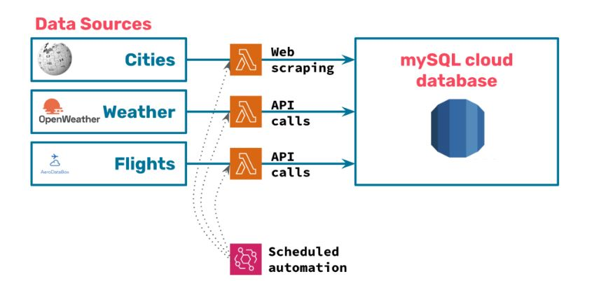

# **Data Engineering: Pipelines on the Cloud**
Why is data engineering important?  
The data Scientist, highly skilled in math, statistics, algorithms and machine learning techniques, requires the relable data foremost, to make a valid prediction. Designing, managing and optimizing the flow of data with databases and throughout the organization can be possible with the help of data engineering.  
Suppose, there is a start-up e-scooter company, which promotes sustainable mobility. But to make there business a operational success, what they need is to „having their scooters parked where users need them“.  
Usually, scooter get rearranged by certain numbers of users moving from point A to point B, and again equal number of users moving from point B to A. But certain elements can cause asymmetries. For example: 
- During morning, there is a general movement from residential neighbourhoods towards the city centre or industrial areas.
- Whenever it starts raining, e-scooter usage decreases drastically.
- In hilly cities, users tend to use scooters to go uphill and then walk downhill.
- Whenever an airplane lands with young tourist traveling with back-packs, a lot of scooters are needed close to the airport.  
Some actions can be taken to solve these asymmetries, namely: using a truck to move scooters around or create economic incentives for users to pick or leave scooters in certain areas.  
Either way, the company must anticipate as much as possible scooter movements. But the roadmap to predict models have to start with collecting data, right? For the analyst, to predict the demand of scooters at the right place and time, I am going to democratize the data by assembling and automating a data pipeline in the cloud. 

### **Data Collection:**
1.	using python’s most popular webscraping library: beautifulsoup, I will scrape data demofraphical dat from the web.
2.	Python’s requests library, i am going to interact with APIs and assemble a request to acquire the specific data, e.g.: weather and Flight information.  

As Python objects are great for local exploration and analysis, but not the best format to make data quickly available to the rest of the company, I will  create a database model by storing the data on a local MySQL instance.

After collecting the data by scraping and APIs requests, I had set up a local database. At this stage, I have weather, flights and population data on Python dictionaries or Pandas dataframes and empty tables on MySQL.  
Now to move this data from one place to the other, I could have used SQLAlchemy, which is the simplest way to connect Python to any SQL. After installing SQLAlchemy, the method pandas.DataFrame.to_sql() will do the rest for you, converting a DataFrame into a MySQL table in a single step. Although the solution that MySQL provides directly is not SQLAlchemy but Connector/Python.  
But what I’ve decided to do in this project to move the data pipeline to the cloud by setting up a cloud MySQL Instance with the help of an AWS account. All I had to do is:
- Sign up for an AWS account.
- Set up a database on AWS RDS.
- Run your Python scripts for data collection on AWS Lambda.
- Schedule your scripts to run automatically with AWS Cloudwatch.

If you think, we liked what you saw, then please let me know through an email, as a token of your appreciation! :pray: :grin:

Connect with me:
[linkedin](https://www.linkedin.com/in/jafrin-hossain/) 
